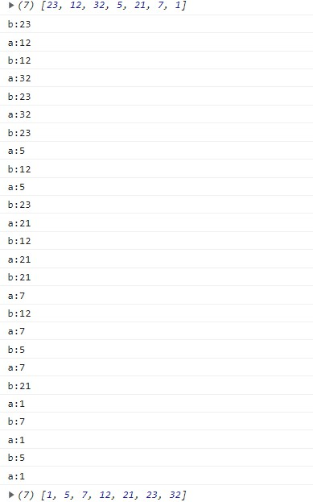

[返回](./js.md)

## js Array.sort的原理

MDN的解释：

如果指明了 compareFn ，那么数组会按照调用该函数的返回值排序。即 a 和 b 是两个将要被比较的元素：

- 如果 compareFn(a, b) 大于 0，b 会被排列到 a 之前。
- 如果 compareFn(a, b) 小于 0，那么 a 会被排列到 b 之前；
- 如果 compareFn(a, b) 等于 0，a 和 b 的相对位置不变。备注：ECMAScript 标准并不保证这一行为，而且也不是所有浏览器都会遵守（例如 Mozilla 在 2003 年之前的版本）；
compareFn(a, b) 必须总是对相同的输入返回相同的比较结果，否则排序的结果将是不确定的。

但，这里a, b分别是什么？

控制台打印看看：
```javascript
let arr = [23, 12, 32, 5, 21, 7, 1]

console.log(arr)
arr.sort((a, b) => {
    console.log("a:" + a)
    return 1
})
console.log(arr)
```



经过分析：\


sort()内部采用了 二分法插入排序

[返回](./js.md)