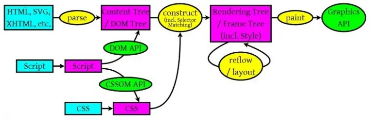

[返回](./index.md)

## 从 URL 输入到页面展现到底发生什么？

主要分为这几步：

1. 浏览器对输入的地址补全，然后DNS域名解析
2. 找到服务器地址，建立TCP连接（三次握手）
3. 发送HTTP请求
4. 服务器处理请求
5. 返回响应结果
6. 关闭TCP连接（四次挥手）
7. 浏览器解析HTML
8. 浏览器布局渲染

### DNS域名解析

- 操作系统会先检查自己本地的hosts文件是否有这个网址映射关系，如果有，就先调用这个IP地址映射，完成域名解析
- 如果hosts里没有这个域名的映射，则查找本地DNS解析器缓存，是否有这个网址映射关系，如果有，直接返回，完成域名解析
- 如果hosts与本地DNS解析器缓存都没有相应的网址映射关系，首先会找TCP/IP参数中设置的首选DNS服务器，在此我们叫它本地DNS服务器，此服务器收到查询时，如果要查询的域名，包含在本地配置区域资源中，则返回解析结果给客户机，完成域名解析，此解析具有权威性
- 如果要查询的域名，不由本地DNS服务器区域解析，但该服务器已缓存了此网址映射关系，则调用这个IP地址映射，完成域名解析，此解析不具有权威性
- 如果本地DNS服务器本地区域文件与缓存解析都失效，则根据本地DNS服务器的设置（是否设置转发器）进行查询，如果未用转发模式，本地DNS就把请求发至13台根DNS，根DNS服务器收到请求后会判断这个域名(.com)是谁来授权管理，并会返回一个负责该顶级域名服务器的一个IP。本地DNS服务器收到IP信息后，将会联系负责.com域的这台服务器。这台负责.com域的服务器收到请求后，如果自己无法解析，它就会找一个管理.com域的下一级DNS服务器地址(http://qq.com)给本地DNS服务器。当本地DNS服务器收到这个地址后，就会找http://qq.com域服务器，重复上面的动作，进行查询，直至找到www.qq.com主机
- 如果用的是转发模式，此DNS服务器就会把请求转发至上一级DNS服务器，由上一级服务器进行解析，上一级服务器如果不能解析，或找根DNS或把转请求转至上上级，以此循环。不管是本地DNS服务器用是是转发，还是根提示，最后都是把结果返回给本地DNS服务器，由此DNS服务器再返回给客户机。

### 建立TCP连接

TCP 三次握手，简单来说就是：1. 客户端向服务端发送SYN请求；2. 服务端接收到并返回SYN+ACK；3. 客户端接收到服务端请求并向服务端返回ACK完成三次握手

### 浏览器解析HTML并渲染

渲染流程如图：

浏览器解析过程：
- HTML,SVG,XHTML，解析生成DOM树。
- CSS解析生成CSS规则树。
- JavaScript用来操作DOM API和CSSOM API，生成DOM Tree和CSSOM API。

浏览器会通过已经解析好的DOM Tree 和 CSS规则树来构造 Rendering Tree
- Rendering Tree 渲染树并不等同于DOM树，因为一些像Header或display:none的东西就没必要放在渲染树中了。
- CSS 的 Rule Tree主要是为了完成匹配并把CSS Rule附加上Rendering。
- Tree上的每个Element。也就是DOM结点，即Frame。然后，计算每个Frame（也就是每个Element）的位置，这又叫layout和reflow过程。

### 什么情况会造成重排和重绘

重排意味着元件的几何尺寸变了，我们需要重新验证并计算Render Tree。是Render Tree的一部分或全部发生了变化。这就是Reflow，或是Layout。
重排因为要重新计算Render Tree，而且每一个DOM Tree都有一个reflow方法，一旦某个节点发生重排，就有可能导致子元素和父元素甚至是同级其他元素的reflow，浪费大量的时间重新验证Render Tree。
因此，重排的成本要比重绘高很多。
以下操作会导致重排或重绘。

- 删除，增加，或者修改DOM元素节点。
- 移动DOM的位置，开启动画的时候。
- 修改CSS样式，改变元素的大小，位置时，或者将使用display:none时，会造成重排；修改CSS颜色或者- visibility:hidden等等，会造成重绘。
- 修改网页的默认字体时。
- Resize窗口的时候（移动端没有这个问题），或是滚动的时候。
- 内容的改变，(用户在输入框中写入内容也会)。
- 激活伪类，如:hover。
- 计算offsetWidth和offsetHeight。

如果当前网页含有一些动画，或者固定不动元素的网页时，由于滚动也会发生重排，一旦发生滚动，当前浏览器所承受的压力很大，就会造成网页的卡顿，掉帧等情况。

### 如何减少重排和重绘

- 尽量避免style的使用，对于需要操作DOM元素节点，重新命名className，更改className名称。
- 如果增加元素或者clone元素，可以先把元素通过documentFragment放入内存中，等操作完毕后，再appendChild到DOM元素中。
- 不要经常获取同一个元素，可以第一次获取元素后，用变量保存下来，减少遍历时间。
尽量少使用dispaly:none，可以使用visibility:hidden代替，dispaly:none会造成重排，visibility:hidden会造- 成重绘。
- 不要使用Table布局，因为一个小小的操作，可能就会造成整个表格的重排或重绘。
- 使用resize事件时，做防抖和节流处理。
- 对动画元素使用absolute / fixed属性。
- 批量修改元素时，可以先让元素脱离文档流，等修改完毕后，再放入文档流。

[返回](./index.md)