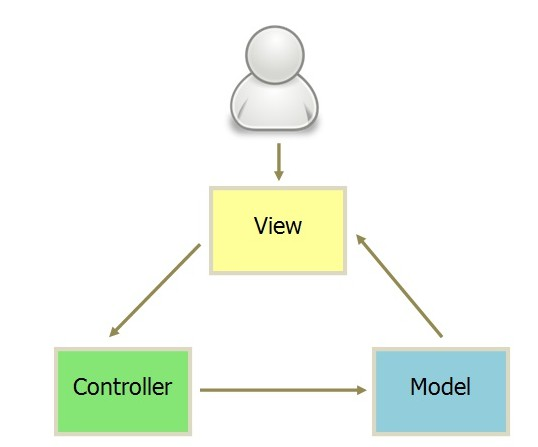
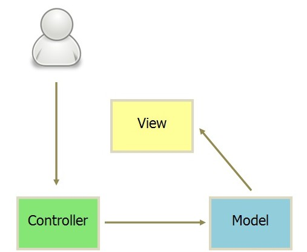
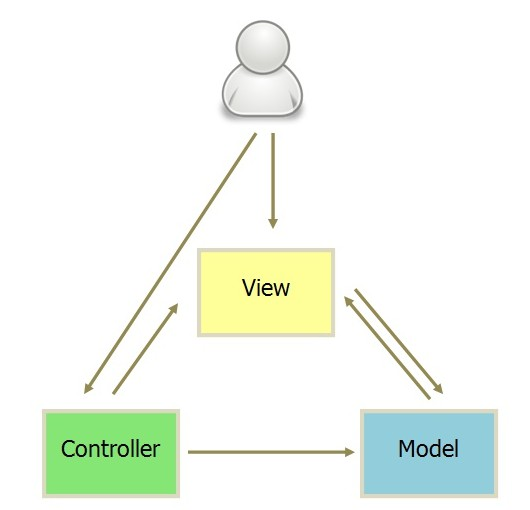
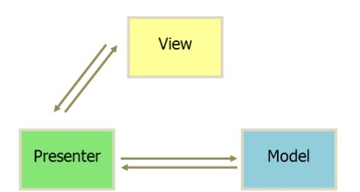
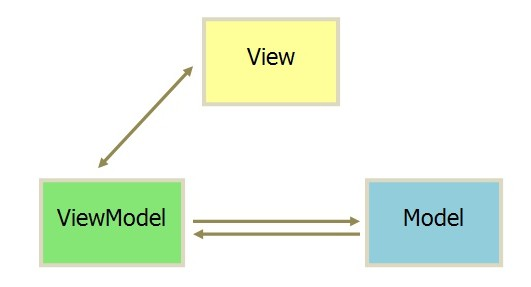

[返回](./index.md)

### 1. MVC

MVC将应用抽象为数据层（Model）、视图（View）、逻辑（Controller），这样数据、视图、逻辑的代码各自汇聚。各层之间的通信模式则没有严格限制，在实际开发中也有各种实现，有一下三种表现：

但有一点可以确定的是，在MVC模式中，Model和View可能有耦合，即MVC仅仅将应用抽象，并未限制数据流。

### 2. MVP

MVP则在MVC基础上，限定了通信方式，即Model和View之间不直接通信，都通过Presenter通信，这个Presenter和MVC中的Controller一脉相承，代表应用中的逻辑层。Presenter负责项目中的逻辑，并且直接与View和Model通信，操作数据更新更新后手动同步到View上。

MVP模式限制了Model和View之间通信，让Model和View解耦更彻底，代码更容易被复用。

MVP模式也有问题，它的问题在于Presenter的负担很重，Presenter需要知道View和Model的结构，并且在Model变化时候需要手动操作View，增加编码负担，降低代码维护性。

### 3. MVVM

于是MVVM设计了VM层，即ViewModel层，ViewModel自动同步数据到视图，用VM代替P之后，MVVM自动从Model映射到View（实现方式是模板渲染），不需要用户手动操作视图，这样代码更简单不易出错，代码更好阅读和维护。

从上面对MVC、MVP、MVVM的描述可以看出，它们是递进关系，不断优化的：MVC中Model和View还有一定程度的耦合，而在MVP和MVVM中View和Model彻底分离，View和Model不知道彼此的存在，View和Model只向外暴露方法让Presenter调用；MVVM通过自动同步数据更新到视图，解决了MVP中手动同步的痛点，简化了代码。

总之：MVC将应用抽象为数据层（Model）、视图层（View）、逻辑层（controller），降低了项目耦合。但MVC并未限制数据流，Model和View之间可以通信。

MVP则限制了Model和View的交互都要通过Presenter，这样对Model和View解耦，提升项目维护性和模块复用性。

而MVVM是对MVP的P的改造，用VM替换P，将很多手动的数据=>视图的同步操作自动化，降低了代码复杂度，提升可维护性。

那么什么是MVVM？MVVM是一种软件架构设计模式，它抽离了视图、数据和逻辑，并限定了Model和View只能通过VM进行通信，VM订阅Model并在数据更新时候自动同步到视图。

[返回](./index.md)