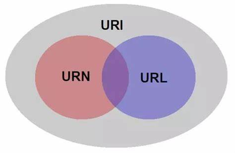

[返回](./index.md)

## URL（Universal Resource Locator）统一资源定位符

URL一个通过位置来标识资源的字符串，是目前网络资源的主要访问机制的。
一个标准的URL必须包括：protocol、host、port、path、parameter、anchor，例如，动物住址协议://地球/中国/浙江省/杭州市/西湖区/某大学/14号宿舍楼/525号寝/张三.人，这样通过该资源的位置可以以定位该资源。
可以看出来，URL是通过位置来确定一个资源的，因此URL是URI的子集，或者说URL是URI的一种实现方式！

## URI（Uniform Resource Identifier）翻译成中文就是统一资源标识符。

RFC2396 分别对这 3 个单词进行了如下定义：

Uniform：规定统一的格式可方便处理多种不同类型的资源，而不用根据上下文环境来识别资源指定的访问方式。另外，加入新增的协议方案（如http:或 ftp:）也更容易。\
Resource：资源的定义是“可标识的任何东西”。除了文档文件、图像或服务（例如当天的天气预报）等能够区别于其他类型的，全都可作为资源。另外，资源不仅可以是单一的，也可以是多数的集合体。\
Identifier：表示可标识的对象。也称为标识符。

还有一个: URN(Universal Resource Name) ，统一资源名称，通过特定命名空间中的唯一名称或ID来标识资源。比如：身份证、DNA就是类似于URN。

他们之间的关系图：

[返回](./index.md)